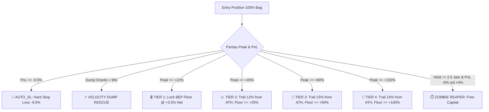

# 🦅 Solana Autonomous Algo Bot (`solana-algobot`)

> **Institutional-Grade Quantitative Trading Engine on Solana**  
> *Dirancang untuk eksekusi berbasis data, asimetri risiko (Power-Law), perlindungan likuiditas, dan mitigasi dump otomatis.*

---

## 📌 Ringkasan Proyek & Konteks Sistem

Repository ini merupakan core engine dari **Solana Algo Trading Bot** (dijalankan di VPS sebagai proses PM2: `solana-algobot`), yang beroperasi berdampingan dengan Whale Tracker Bot (`solana-tradingbot`).

Berbeda dengan bot retail konvensional yang mengandalkan indikator tertinggal (lagging) atau spekulasi tick semata, sistem ini menerapkan **arsitektur kuantitatif hedge fund**:
1. **Goldilocks Quantitative Filtering:** Hanya masuk ke aset yang memiliki rasio volume/MC, kedalaman likuiditas, dan dispersi pemegang token yang sehat (Skor Masuk $\ge 75/100$).
2. **Opsi 1: 100% Dynamic Ratchet Trailing Stop:** Menghapus sepenuhnya parsial Take-Profit (Half TP) untuk mengeliminasi beban *double swap fee & priority fee*, memaksimalkan compounding 100% modal pada *multi-bagger parabolic runners*.
3. **Institutional Capital Preservation:** Proteksi Hard SL $-9.5\%$, *Velocity Dump Rescue* ($<90$s collapse), *Reality Guard* (anti-phantom tick), *Zombie Reaper* (likuidasi koin stagnan $\ge 2.5$ jam), dan **Karantina 24 Jam** pasca stop loss untuk mencegah *toxic repeat churn*.

---

## 🏛️ Arsitektur Modul

```text
src/
├── services/
│   ├── algoScanner.ts      # Engine pemindaian kuantitatif, scoring, dan filter Goldilocks (Score >= 75)
│   ├── marketStreamer.ts   # Telemetri WebSocket real-time, tracker harga posisi aktif, & watchlist scanner
│   ├── tradeManager.ts     # Manajemen posisi, Dynamic Ratchet Trailing, Reality Guard, & eksekusi buy/sell
│   ├── antirug.ts          # Validasi on-chain: Mint Authority, Freeze Authority, LP Burned, Dev Holding
│   ├── dexSimulator.ts     # Simulasi biaya DEX riil (Pump.fun 1.25%, Raydium AMM, dynamic slippage & priority)
│   ├── dexscreener.ts      # Fetching data pasar & multi-token batch query
│   ├── jupiter.ts          # Integrasi routing quote & swap on-chain Jupiter
│   └── solanaConnection.ts # Koneksi RPC Solana cluster & pool fallbacks
├── bot/
│   └── telegram.ts         # Handler antarmuka Telegram bot & tombol interaktif
├── db/
│   └── index.ts            # SQLite database layer (positions, trade_history, whales, wallet)
├── config.ts               # Parameter global, batas risiko, & environment variables
└── index.ts                # Master entry point aplikasi
```

---

## 🎯 Logika & Filosofi Eksekusi (Opsi 1: 100% Single-Exit)

Berdasarkan audit kuantitatif mendalam, strategi **Half TP (50:50 / Partial Exit)** di pasar Solana memotong ekspektasi profit hingga 40-60% karena:
- Terkena **biaya ganda**: Biaya transaksi Solana (priority fee), LP fee DEX (0.25% - 1.25%), dan slippage dipungut **dua kali** pada satu posisi.
- Mengurangi ukuran *moonbag* saat token sedang berada di fase awal *exponential run*.

Sistem kini menggunakan arsitektur **100% Dynamic Ratchet Trailing Stop**:



### 1. Tangga Dynamic Ratchet:
- **Hard Stop-Loss ($-9.5\%$):** Batas toleransi kerugian keras terstruktur untuk memberi ruang volatilitas normal spread DEX tanpa membiarkan modal tergerus dalam.
- **Velocity Dump Rescue:** Jika harga anjlok drastis dalam $<90$ detik sejak entry, posisi langsung dilikuidasi seketika tanpa menunggu Hard SL tersentuh (menyelamatkan modal dari dev dump mendadak).
- **Tier 1 (Peak $\ge +22\%$ $\rightarrow$ Kunci $+3.5\%$ Net BEP):** Sekali token mencapai kenaikan $+22\%$, *ratchet floor* otomatis terkunci pada $+3.5\%$ Net. Trade tersebut **100% dijamin bebas risiko modal** (modal pokok + estimasi total swap fee sudah aman).
- **Tier 2 (Peak $\ge +45\%$ $\rightarrow$ Lock $\ge +25\%$):** Trailing stop $12\%$ di bawah titik tertinggi (ATH), lantai minimal $+25\%$.
- **Tier 3 (Peak $\ge +80\%$ $\rightarrow$ Lock $\ge +50\%$):** Trailing stop $15\%$ di bawah ATH, lantai minimal $+50\%$.
- **Tier 4 (Peak $\ge +150\%$ God Candle $\rightarrow$ Lock $\ge +100\%$):** Trailing stop $15\%$ di bawah ATH, lantai minimal $+100\%$.

### 2. Zombie Time-Stop Reaper:
- Posisi yang bertahan $\ge 2.5$ jam namun bergerak menyamping/stagnan (PnL berada di antara $-6.0\%$ hingga $+4.0\%$) otomatis dilikuidasi (`ZOMBIE_REAPER_STAGNANT`).
- Mengembalikan likuiditas SOL ke *pool modal* agar tidak tertahan pada koin mati.

---

## 🛡️ Lapisan Pertahanan & Anti-Exploit

### 1. Anti-Pucuk (No Raw WS Blind Buys)
- `marketStreamer.ts` **dilarang melakukan eksekusi beli otomatis** hanya karena melihat tick lonjakan harga $+2\%$.
- Pembelian hanya diizinkan melalui `algoScanner.ts` setelah token lolos seluruh filter keamanan, rasio volume, dan skor minimum $\ge 75$.

### 2. Reality Guard (Anti-Phantom Spike)
- Sebelum menjual pada kondisi Take-Profit / Trailing Stop, bot meminta quote riil ke DEX aggregator (Jupiter on-chain).
- Jika quote riil DEX menunjukkan harga $\le$ harga entry (yang menandakan lonjakan grafik di DexScreener hanyalah anomali tick/phantom spike tanpa likuiditas), **eksekusi dibatalkan** untuk mencegah bot menjual dalam kondisi rugi.

### 3. Karantina 24 Jam (1440 Menit) Pasca SL
- Token yang pernah terkena `AUTO_SL` atau `VELOCITY_DUMP` otomatis masuk ke daftar karantina selama 24 jam penuh di database SQLite (`getLastClosedPosition`).
- Menghentikan kebiasaan buruk *revenge trading* atau membeli berulang kali token yang sedang berada dalam tren *macro-downtrend* (*toxic repeat churn*).

---

## 📊 Skema Database (`tradingbot.db`)

Bot menggunakan SQLite lokal berkecepatan tinggi:

1. **`positions`**:
   - Menyimpan posisi aktif (`status = 'OPEN'`) dan tertutup (`CLOSED`).
   - Field kunci: `token_address`, `token_symbol`, `entry_price_usd`, `current_price_usd`, `highest_price_usd` (untuk trailing ATH), `amount_tokens`, `cost_sol`, `pnl_percent`, `pnl_usd`.
2. **`trade_history`**:
   - Rekam jejak permanen semua transaksi yang ditutup beserta `close_reason`, `exit_price_usd`, net PnL SOL & USD.
3. **`whales`**:
   - Roster dompet paus (untuk modul pelacak whale).
4. **`wallet`**:
   - Saldo virtual paper trading (`paper_balance_sol`) atau rekam jejak modal live.

---

## ⚙️ Variabel Lingkungan (`.env`)

```env
# Telegram Bot & Admin Configuration
TELEGRAM_BOT_TOKEN=your_telegram_bot_token_here
TELEGRAM_ADMIN_ID=your_telegram_admin_id_here

# Solana Cluster & RPC
SOLANA_RPC_URL=https://mainnet.helius-rpc.com/?api-key=YOUR_HELIUS_KEY
HELIUS_API_KEY=YOUR_HELIUS_KEY

# Trading Mode & Sizing
PAPER_TRADING=true
INITIAL_PAPER_BALANCE_SOL=1.0
DEFAULT_BUY_AMOUNT_SOL=0.05
SLIPPAGE_PCT=2.5

# Risk & Trailing Parameters
STOP_LOSS_PCT=9.5
TAKE_PROFIT_PCT=45.0
TRAILING_STOP_PCT=12.0
MAX_PRICE_DRIFT_PCT=6.0

# Scanner & Ingestion Floors
MIN_LIQUIDITY_USD=30000.0
MIN_VOLUME_24H_USD=150000.0
MIN_MARKET_CAP_USD=15000.0
MAX_OPEN_POSITIONS=15
```

---

## 🖥️ Panduan Deployment & Operasional

Bot dijalankan dengan **PM2** sebagai process manager. Sesuaikan nama proses PM2 di `ecosystem.config.cjs` sesuai kebutuhan.

### Perintah Operasional PM2:
```bash
# Cek status semua proses
pm2 status

# Pantau log eksekusi real-time
pm2 logs solana-algobot

# Restart setelah update kode
npm run build
pm2 restart solana-algobot
```

> **Catatan Teknis:** Bot dijalankan menggunakan Node.js v22 dengan parameter `--dns-result-order=ipv4first` melalui runner `tsx src/index.ts`.

---


## 📱 Daftar Perintah Telegram Bot

| Perintah | Deskripsi |
|---|---|
| `/status` atau `/start` | Menampilkan dashboard sistem, PnL berjalan, status mode (Paper/Live), dan saldo SOL |
| `/positions` | Melihat rincian posisi trade yang sedang aktif dibuka secara real-time |
| `/history` | Menampilkan 10 riwayat trade terakhir yang sudah ditutup beserta alasan exit |
| `/audit <mint>` | Melakukan audit keamanan token on-chain seketika (Anti-Rug analysis) |
| `/buy <mint> [sol]` | Melakukan eksekusi beli sniper terarah secara manual |
| `/sell <pos_id>` | Melikuidasi posisi trade yang sedang aktif secara manual |
| `/resetpaper` | Mereset saldo virtual Paper Trading kembali ke saldo awal |
| `/settings` | Memeriksa konfigurasi aktif dan parameter threshold risiko |

---

## 📝 Catatan Audit Forensik & Sejarah Optimalisasi (Untuk Agen Hermes)

Jika Anda (Hermes) melanjutkan optimasi atau inspeksi di masa mendatang, perhatikan latar belakang historis berikut:

1. **Mengapa Win Rate Masa Lalu Rendah (13.33%)?**
   - Bukan karena salah analisa makro, melainkan karena bot sebelumnya mengeksekusi pembelian langsung dari *raw WebSocket tick* (+2% spikes). Ini membuat bot selalu masuk di puncak tertinggi lilin exhausted buyer sebelum harga koreksi normal.
   - **Solusi yang telah terpasang:** WS impulsive buy telah dimatikan total; eksekusi entry diserahkan 100% ke scanner kuantitatif dengan filter momentum berbobot.

2. **Kasus Anomali LEVERCAT:**
   - DexScreener sempat memancarkan glitch tick $+1548\%$. Mekanisme lama bot langsung memicu Stage 1 TP untuk jual sebagian (40%). Namun quote on-chain DEX ternyata berada di $-5.52\%$ di bawah entry, sehingga bot menjual rugi dan mengunci moonbag di level fiktif.
   - **Solusi yang telah terpasang:** *Reality Guard* memverifikasi quote on-chain Jupiter $\le$ harga entry sebelum memperbolehkan TP.

3. **Perhitungan Akuntansi Parsial di SQLite:**
   - Ditemukan bug historis di `halfClosePosition` yang menggunakan formula hardcoded `/ 2` (50%) saat mengeksekusi jual 40%, yang mendistorsi sisa token dan PnL.
   - **Solusi yang telah terpasang:** Formula telah diperbaiki menjadi kalkulasi fraksi proporsional presisi (`fractionClosed = actualSoldTokens / pos.amount_tokens`). Dengan penerapan Opsi 1 (100% single exit), seluruh potensi friksi parsial tereliminasi.
